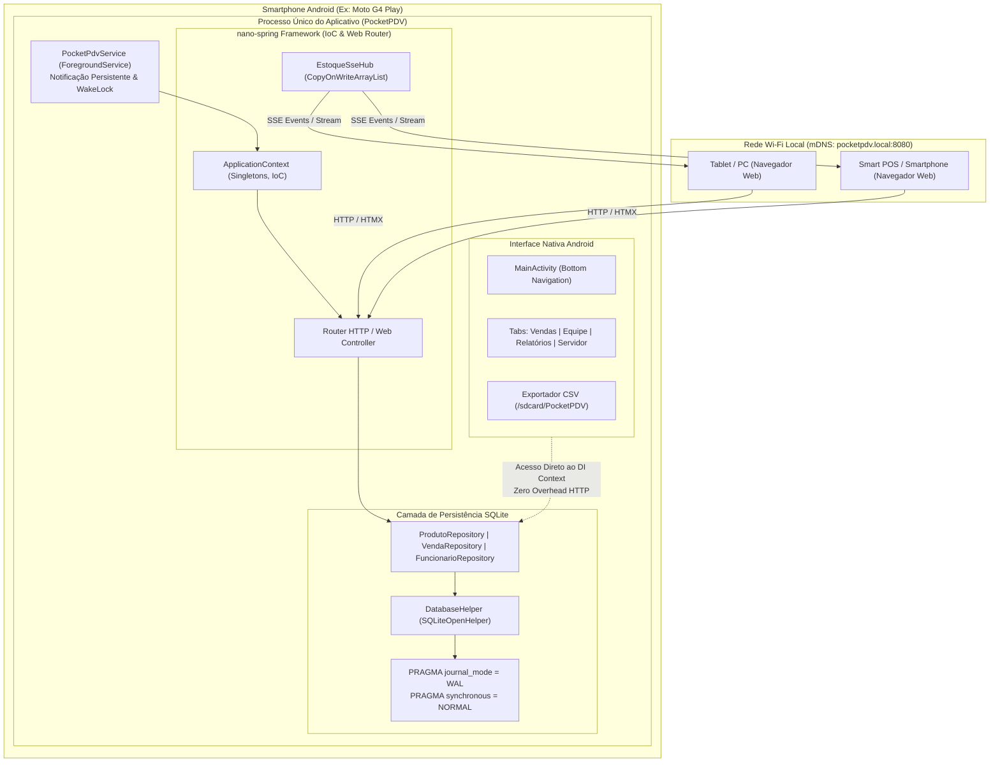
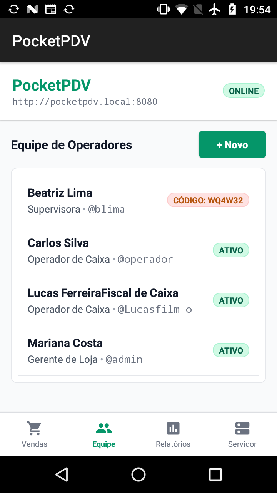
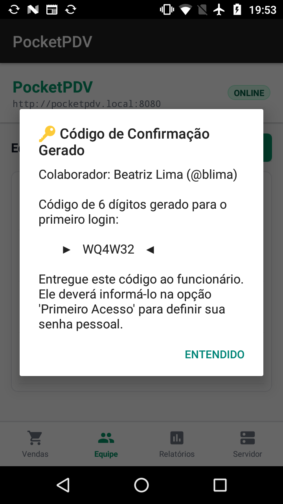
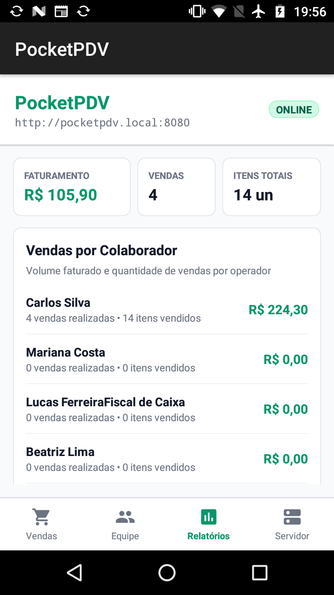
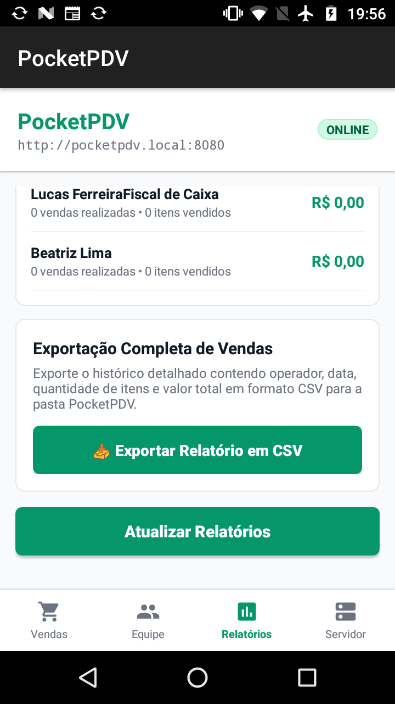
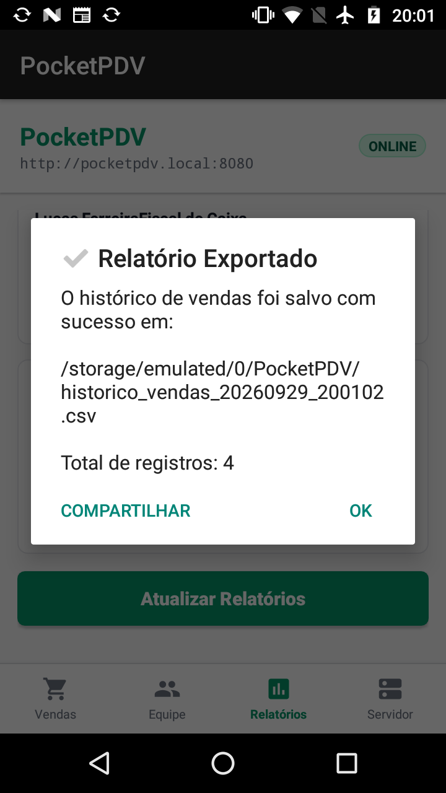

# PocketPDV 📱⚡

[](https://developer.android.com)
[](https://www.oracle.com/java/)
[](https://github.com/matheuscruzsouza/nano-spring)
[](#arquitetura-do-sistema)
[](#telemetria-e-desempenho)
[](LICENSE)

O **PocketPDV** é um sistema completo e resiliente de Ponto de Venda (PDV) híbrido, projetado para operar com altíssima performance em smartphones legados (hardware de referência: *Motorola Moto G4 Play*, Snapdragon 410, 1 GB/2 GB RAM, Android 7.1.1).

O aplicativo combina um **servidor web HTTP/SSE local embarcado** gerenciado via `ForegroundService` e movido pelo framework minimalista [**nano-spring**](https://github.com/matheuscruzsouza/nano-spring), com uma interface **Android nativa com Bottom Navigation**, além de um **PDV Web responsivo em HTMX** acessível por qualquer dispositivo conectado à mesma rede Wi-Fi via mDNS (`http://pocketpdv.local:8080`).

---

## 🌟 Principais Recursos

### 📲 Interface Mobile Nativa (Android)
- **Bottom Navigation Bar**: Barra de navegação inferior compacta com ícones vetoriais modernos (`Vendas`, `Equipe`, `Relatórios` e `Servidor`).
- **Dashboard Operacional de Vendas**: Visão em tempo real de faturamento diário, total de transações, itens vendidos e alertas de produtos com estoque crítico.
- **Gestão de Equipe & Primeiro Acesso Seguro**:
  - Cadastro de novos operadores com geração automática de **código de confirmação alfanumérico de 6 dígitos**.
  - Badge visual de status (`ATIVO` ou `CÓDIGO: XXXXXX`) para acompanhamento de ativações pendentes.
  - O operador utiliza o código para definir sua senha de acesso no primeiro login na interface web.
- **Relatórios Gerenciais Consolidados**:
  - Indicadores globais (Faturamento, Total de Vendas e Itens Comerciais).
  - Ranking de Desempenho por Colaborador (volume faturado e quantidade de vendas).
- **Exportação de Vendas em CSV na Raiz**:
  - Exportação instantânea de todo o histórico detalhado em formato CSV compatível com Excel (`UTF-8 com BOM`).
  - Salvamento direto na raiz da memória interna em `/sdcard/PocketPDV/historico_vendas_YYYYMMDD_HHmmss.csv`.
  - Notificação de mídia via `MediaScannerConnection` para visibilidade imediata no PC ou explorador de arquivos.
- **Painel do Servidor & Telemetria**:
  - Status do servidor `nano-spring`, IP local na rede Wi-Fi, porta ativa, mDNS (`pocketpdv.local`) e consumo de RAM PSS em tempo real.

### 🌐 PDV Web Responsivo (Rede Local)
- **Acesso Descentralizado**: Qualquer tablet, notebook, máquina de cartão inteligente ou smartphone conectado ao Wi-Fi acessa o PDV via navegador em `http://pocketpdv.local:8080`.
- **Interatividade Reativa com HTMX**: Adição ao carrinho, cálculo dinâmico de troco, finalização de venda e modais sem necessidade de recarregar a página.
- **Gestão de Estoque Completa**: Modal de visualização rápida, ajuste manual de quantidades e cadastro de novos itens com estoque mínimo.
- **Atualização em Tempo Real via SSE (Server-Sent Events)**:
  - Hub reativo `EstoqueSseHub` que transmite eventos `estoque-atualizado` imediatamente quando uma venda é confirmada ou um estoque é ajustado.
  - Atualização automática dos badges de estoque nas telas web de todos os terminais conectados simultaneamente.
- **Autenticação Segura & Primeiro Acesso**:
  - Sessões gerenciadas por cookies HTTP.
  - Tela de primeiro acesso (`/primeiro-acesso`) para ativação de novos colaboradores via código alfanumérico.

---

## 🏗️ Arquitetura do Sistema



### Invariantes e Diretrizes Arquiteturais
1. **Zero Loopback Overhead**: A interface nativa Android consome diretamente os repositórios e serviços Java em memória, sem trafegar dados via socket HTTP local desnecessariamente.
2. **SQLite WAL (Write-Ahead Logging)**: Leituras concorrentes do servidor web e da UI Android nunca bloqueiam gravações no banco de dados.
3. **Limite Estrito de Memória**: O consumo total de memória RAM (PSS) deve permanecer abaixo de 40 MB durante a operação plena.

---

## 📸 Demonstração Visual

| Bottom Navigation & Equipe | Código de 6 Dígitos (1º Acesso) | Relatórios Consolidados |
|:---:|:---:|:---:|
|  |  |  |

| Exportação CSV Destacada | Confirmação em `/sdcard/PocketPDV` |
|:---:|:---:|
|  |  |

---

## 📡 Endpoints do Servidor Web

| Método | Rota | Descrição |
|:---:|:---|:---|
| `GET` | `/` | Redirecionamento condicional para `/login` ou `/pdv` |
| `GET` | `/login` | Página de autenticação do operador |
| `POST` | `/login` | Validação de credenciais e criação de sessão |
| `GET` | `/logout` | Encerramento de sessão ativa |
| `GET` | `/primeiro-acesso` | Formulário para definir senha através do código de 6 dígitos |
| `POST` | `/primeiro-acesso` | Confirmação de código e gravação da nova senha |
| `GET` | `/pdv` | Painel operacional do PDV (produtos, carrinho e checkout) |
| `GET` | `/pdv/carrinho` | Fragmento HTML do carrinho de compras (HTMX) |
| `POST` | `/pdv/carrinho/adicionar` | Adiciona item ao carrinho |
| `POST` | `/pdv/carrinho/remover` | Remove ou decrementa item |
| `POST` | `/pdv/carrinho/limpar` | Esvazia o carrinho |
| `POST` | `/pdv/checkout` | Confirma a venda, atualiza o estoque e emite SSE |
| `GET` | `/pdv/estoque` | Modal de gestão de estoque |
| `POST` | `/pdv/estoque/ajuste` | Ajusta quantidade em estoque de um produto |
| `POST` | `/pdv/estoque/novo` | Cadastra novo produto via modal |
| `GET` | `/pdv/eventos/estoque` | **Stream SSE** para sincronização em tempo real de estoque |
| `GET` | `/api/status` | Telemetria e diagnóstico do servidor em JSON |

---

## 🛠️ Tecnologias Utilizadas

- **Linguagem:** Java 8 / Java 17
- **Plataforma:** Android SDK (API 25: Android 7.1.1 Nougat / API 34 Compile)
- **Servidor Web & IoC:** [`com.github.matheuscruzsouza:nano-spring:1.5.0`](https://github.com/matheuscruzsouza/nano-spring)
- **Banco de Dados:** SQLite 3 nativo com modo WAL habilitado
- **Frontend Web:** HTML5, CSS3, [HTMX](https://htmx.org/) e Server-Sent Events (SSE)
- **Service Discovery:** Android NSD (Network Service Discovery / mDNS)
- **CI/CD:** GitHub Actions com deploy contínuo no GitHub Pages

---

## 🚀 Como Compilar e Executar

### Pré-requisitos
- **JDK 17** instalado e configurado no `PATH`.
- **Android SDK** com Build-Tools 34.0.0 e plataformas instaladas.
- Dispositivo Android com Depuração USB ativada ou emulador configurado.

### 1. Clonar o Repositório
```bash
git clone https://github.com/SEU-USUARIO/PocketPDV.git
cd PocketPDV
```

### 2. Compilar o Projeto
```bash
./gradlew assembleDebug
```

### 3. Instalar no Dispositivo via ADB
```bash
adb install -r app/build/outputs/apk/debug/app-debug.apk
```

### 4. Executar o Aplicativo
```bash
adb shell am start -n com.github.matheuscruzsouza.pocketpdv/.ui.MainActivity
```

### 5. Acesso ao Servidor Web
- **Pelo próprio PC (via redirecionamento de porta USB):**
  ```bash
  adb forward tcp:8080 tcp:8080
  ```
  Acesse no navegador: [http://localhost:8080](http://localhost:8080)
- **Por outros dispositivos na mesma rede Wi-Fi:**
  Acesse no navegador: `http://pocketpdv.local:8080` (ou utilize o IP local exibido na aba *Servidor* do app).

---

## 📊 Telemetria e Desempenho

Valores aferidos no Motorola Moto G4 Play (Android 7.1.1) em execução ativa com servidor web e UI conectados:

| Métrica | Valor Medido | Meta de Projeto | Status |
|:---|:---:|:---:|:---:|
| **RAM Total (PSS)** | **36.4 MB** (37.328 KB) | < 40.0 MB | ✅ Aprovado |
| **Native Heap** | 5.1 MB | < 10.0 MB | ✅ Aprovado |
| **Dalvik Heap** | 4.2 MB | < 8.0 MB | ✅ Aprovado |
| **Tempo de Inicialização (`nano-spring`)** | ~280 ms | < 500 ms | ✅ Aprovado |
| **Conexões SSE Concorrentes** | 8 clientes | - | ✅ Estável |

---

## 📄 Licença

Este projeto está licenciado sob a licença [MIT](LICENSE).
